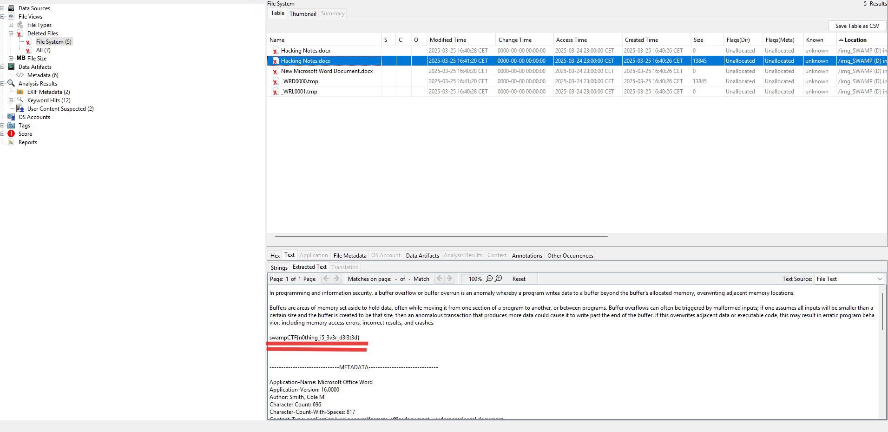

# CTF Write-up: Lost Class Notes  

## Challenge Description  
> *I accidentally lost some of my class notes! Can you help me recover it?*  
> *(Note: Unzipped size is 4GB)*  

### Provided Files  
- `SWAMP_D_image.zip` → Extracts to `SWAMP (D) image.vhd` (Virtual Hard Disk)  

---

## Solution  

1. **Analyzing the Virtual Hard Disk**  
   Since a `.vhd` file is provided, we use **Autopsy** to examine its contents.  

2. **Inspecting Deleted Files**  
   While browsing the file system, we notice several deleted files. This makes us curious, prompting a deeper inspection.  

3. **Recovering the Lost Notes**  
   - Navigating to the deleted files section, we find a file named **"Hacking Notes"**.  
   - Upon opening it, we discover the **flag**! 🎉  

  

---

### Tools Used  
- **Autopsy** (Digital Forensics Platform)  

