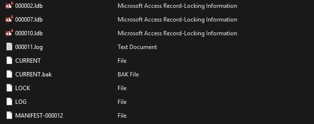

# CTF Write-up: Planetary Storage  

## Challenge Description  
> *My friend found this strange file while perusing his computer, but we can't read it. Can you figure out what it is and get the information from it?*  

> **Difficulty:** Easy/Medium  
> **The flag is in the standard format.**  

### Provided Files  
- `PlanetaryStorage.zip` → Contains **Database Lock Files**  



---

## Solution  

### 1. Inspecting the Files  
Upon extracting the ZIP file, we find **.ldb** files, which are commonly used as **LevelDB database lock files**.  

### 2. Extracting Readable Data  
We run the `strings` command to search for readable text inside the `.ldb` files:  

```bash
strings *.ldb
```  

We observe **JSON structures** containing **Base64-encoded payloads**, such as:  

```json
"payload":"eyJrZXkiOiJcIjNhNDdiYmZiLTgyMmMtNDU1Mi04N2VjLTUyNTA4ZDk0OGJkOFwiIiwib3AiOiJQVVQiLCJ2YWx1ZSI6ImV5SmtZWFJoSWpwYklsUm9hWE1pTENKcGN5SXNJbUVpTENKeVpXUWlMQ0pvWlhKeWFXNW5JU0pkTENKcFpDSTZJbHdpTTJFME4ySmlabUl0T0RJeVl5MDBOVFV5TFRnM1pXTXROVEkxTURoa09UUTRZbVE0WENJaWZRPT0ifQ=="
```  

### 3. Decoding Base64 Data  
We **decode the "payload" field** using `base64`:  

```bash
echo "eyJrZXkiOiJcIjNhNDdiYmZiLTgyMmMtNDU1Mi04N2VjLTUyNTA4ZDk0OGJkOFwiIiwib3AiOiJQVVQiLCJ2YWx1ZSI6ImV5SmtZWFJoSWpwYklsUm9hWE1pTENKcGN5SXNJbUVpTENKeVpXUWlMQ0pvWlhKeWFXNW5JU0pkTENKcFpDSTZJbHdpTTJFME4ySmlabUl0T0RJeVl5MDBOVFV5TFRnM1pXTXROVEkxTURoa09UUTRZbVE0WENJaWZRPT0ifQ==" | base64 -d
```  

This reveals another **JSON structure** with a second **Base64-encoded "value" field**.  

### 4. Recursive Decoding  
We repeat the **Base64 decoding** process on the `"value"` field, using the same command.  

- Some decoded values contained **red herrings** (`"This is a red herring!"`).  
- Eventually, we uncover the **final flag**:  

```plaintext
swampCTF{1pf5-b453d-d474b453}
```

---

## Tools Used  
- **strings** (Extract readable text from binary files)  
- **base64** (Decode Base64-encoded data)  


---

🏆 **Flag:** `swampCTF{1pf5-b453d-d474b453}`  

