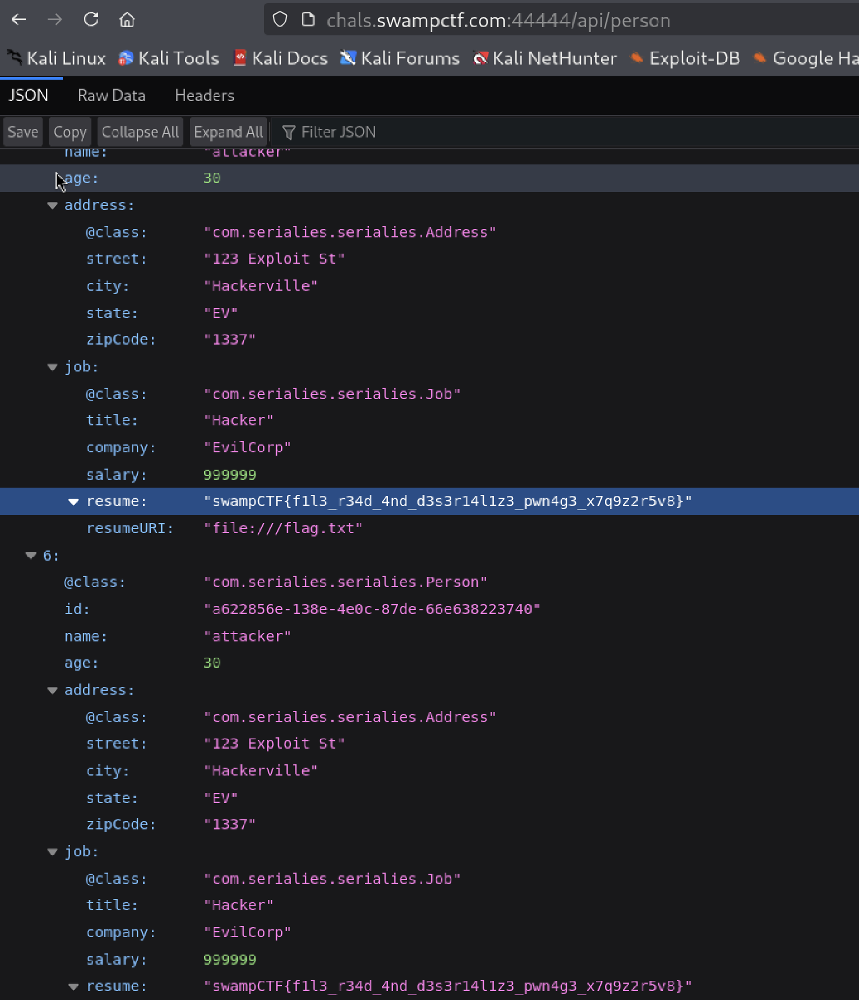

# The application uses Jackson for JSON serialization/deserialization with polymorphic type handling enabled, and the vulnerability exists in the JacksonConfig class:
objectMapper.activateDefaultTyping(ptv, ObjectMapper.DefaultTyping.NON_FINAL, JsonTypeInfo.As.PROPERTY);

# Allows deserialization of polymorphic types
Only allows specific classes in a defined allowlist (Person, Address, Job)
But the configuration has a critical flaw: ExactAddress extends Address and would be allowed even though it's not explicitly listed

# I identified the /api/person endpoint from the code they provided, specifically from the PersonController.java file. Here's the relevant part at the beginning of that file:

@RestController
@RequestMapping("/api/person")
public class PersonController {
    // ...
}

Than i accessed  -> http://chals.swampctf.com:44444/api/person and found:

