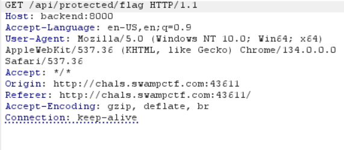

# CTF Write-up: Next.js Middleware Bypass  

## Challenge Description  
> *The Gator Research Institute asked me to develop an app for them. I've been hearing a lot of hullabaloo recently about Next.js, so I decided to make my app inspired by their code. Can you see if you can access the flag?*  
> *Authentication hasn't been implemented yet, so you'll need to find a way around it.*  

### Target  
- **Website**  

---

## Solution  

### 1. Exploring the Website  
The website contains **three pages**:  
- **Home**  
- **Login**  
- **Secret Flag**  

On the **Secret Flag Page**, we find this **hint**:  
> *"Hint: Only swamp creatures can access this page. Maybe there's a way to convince the API that you're a server-side middleware process..."*  

This suggests a **Middleware Authorization Bypass vulnerability**.

---

### 2. Analyzing Network Requests  
Checking the **developer console**, we see this **error message**:  
```plaintext
GET http://backend:8000/api/protected/flag net::ERR_NAME_NOT_RESOLVED
```  
This means the webpage is trying to connect to a local `backend:8000` server, but our browser **cannot resolve it**.

---

### 3. Intercepting the Request with Burp Suite  
Using **Burp Suite**, we capture the **GET request** to `/api/protected/flag`. 
 
The server attempts a request to `backend:8000`, which **does not work for us**.  

We modify the **Host Header** to redirect the request to the actual challenge server:  
```http
Host: chals.swampctf.com:43611
```  

After doing this, we get the following response:  
```json
{
  "message": "Unauthorized. Only swamp creatures allowed!"
}
```  
This confirms that the request is reaching the **correct backend**, but **authorization is still blocking us**.

---

### 4. Exploiting Middleware Authorization Bypass  
Based on the **hint**, we suspect that **Next.js middleware** is verifying whether the request is coming from a server process.  
A **bypass technique** is adding the `X-Middleware-Subrequest` header.  

We modify the request by adding:  
```http
X-Middleware-Subrequest: random
```  
After sending the request, **authorization is bypassed**, and we receive the **flag**.

---

## Flag  
```plaintext
swampCTF{b3w4r3_th3_m1ddl3w4r3}
```

---

## Tools & Techniques Used  
- **Developer Console** – Identified network errors and backend connection issues.  
- **Burp Suite** – Intercepted and modified API requests.  


---

🏆 **Final Flag:** `swampCTF{b3w4r3_th3_m1ddl3w4r3}`
